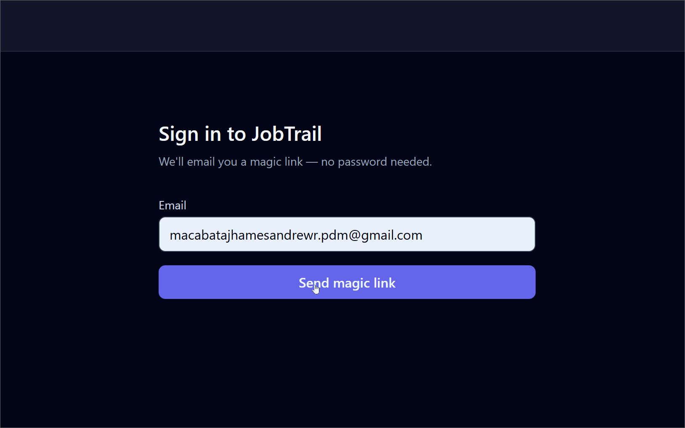
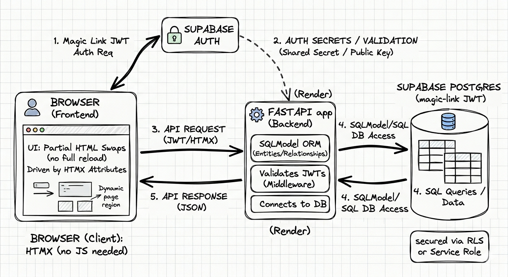

# JobTrail

> A personal job application tracker built during my own job hunt — because spreadsheets lose context fast.


**Live demo**: [jobtrail-0gza.onrender.com](https://jobtrail-0gza.onrender.com) *(free tier — first load may take ~30s to wake)*

> Sign in with your own email — magic link, no password needed.

---

<!-- Replace with your actual demo GIF -->


---

## The problem

During a job hunt you apply to dozens of roles across weeks. A spreadsheet works for a week, then cells get messy, statuses go stale, and you forget which companies you followed up with. JobTrail keeps every application in one place with a live dashboard so you always know where you stand.

## Features

- **Track applications** — company, role, status, date applied, job URL, notes
- **Inline editing** — edit or delete any row without a page reload (HTMX)
- **Status filter** — filter by Applied / Interviewing / Offered / Rejected / Ghosted
- **Dashboard** — count cards per status + bar chart of weekly application volume
- **Auth** — magic-link email sign-in via Supabase; each user sees only their own data
- **CI** — GitHub Actions runs pytest on every push

## Architecture

```
Browser
  │  HTMX (partial HTML swaps, no full page reloads)
  ▼
FastAPI app (Render)
  │  SQLModel ORM
  ▼
Supabase Postgres ◄── Supabase Auth (magic-link JWT)
```

<!-- Replace with your excalidraw export -->


## Tech stack

| Layer | Choice | Why |
|-------|--------|-----|
| Backend | FastAPI + SQLModel | Modern Python, type-safe models, auto docs |
| Database | PostgreSQL (Supabase) | Free hosted Postgres with auth built in |
| Frontend | Jinja2 + HTMX + Tailwind | Zero build step, feels like an SPA without React |
| Auth | Supabase magic-link | No passwords to store; HttpOnly cookie session |
| Deploy | Render free tier | One `render.yaml`, auto-deploys on push |
| Tests | pytest + httpx | 10 tests covering CRUD, auth guards, and user isolation |
| CI | GitHub Actions | Runs on every push to `main` |

## Local setup

```bash
git clone https://github.com/neuralxjam/jobtrail
cd jobtrail
pip install uv
uv pip install -r requirements.txt
cp .env.example .env          # fill in your Supabase credentials
uvicorn app.main:app --reload # open http://localhost:8000
```

## Running tests

```bash
pytest --tb=short -q
```

## Project structure

```
jobtrail/
├── app/
│   ├── main.py           ← app factory, routers, exception handlers
│   ├── auth.py           ← Supabase client, current_user dependency
│   ├── models.py         ← SQLModel table definitions
│   ├── database.py       ← engine + session dependency
│   ├── routes/
│   │   ├── applications.py  ← CRUD endpoints
│   │   ├── dashboard.py     ← status counts + weekly chart data
│   │   └── auth.py          ← login, callback, logout
│   └── templates/
│       ├── base.html
│       ├── index.html
│       ├── dashboard.html
│       ├── login.html
│       └── partials/        ← HTMX fragments
├── tests/
│   ├── conftest.py       ← SQLite test DB + fake user fixtures
│   ├── test_auth.py
│   └── test_applications.py
├── .github/workflows/ci.yml
├── render.yaml
└── requirements.txt
```

## Limitations / roadmap

- **Free tier sleep** — Render spins down after 15 min idle; first request takes ~30s
- **Single-process PKCE** — magic-link code exchange uses in-memory storage; would break with multiple Render workers (upgrade to paid tier or use Redis)
- **No pagination** — works fine for personal use; would need cursor-based pagination at scale
- **Potential additions** — email reminders for stale applications, CSV export, interview prep notes per application
